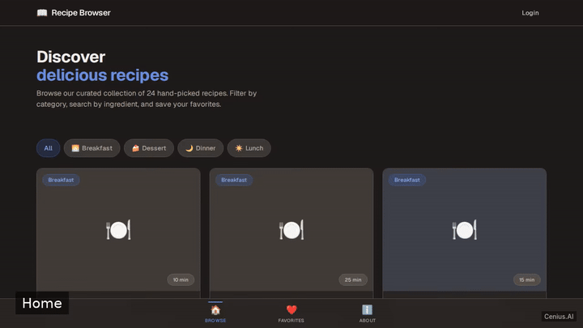
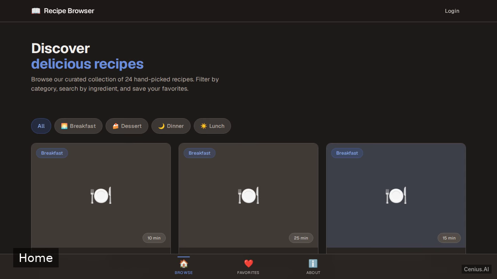
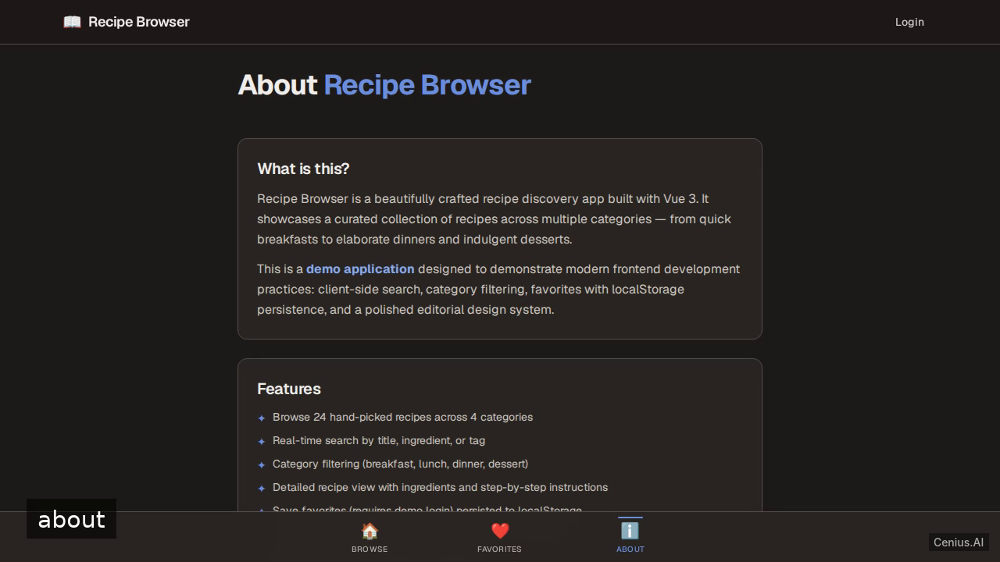

# Recipe Browser SPA with Vue 3 — Vite recipe manager reference implementation

**Recipe Browser SPA with Vue 3** is a free, open-source recipe manager written in Vite. Build a production-quality single-page recipe browser application using Vue 3 and Vite. Every Recipe Browser SPA with Vue 3 file — code, design, seeded demo data — ships in this repository under the Apache-2.0 license. Self-host it, or [remix Recipe Browser SPA with Vue 3 on cenius.ai](https://cenius.ai/marketplace/p/recipe-browser-spa-with-vue-3?ref=gh&utm_campaign=recipe-browser-spa-with-vue-3-vite) to get a custom build with full rebrand rights.

  

> **▶ [Open & edit in cenius.ai](https://cenius.ai/marketplace/p/recipe-browser-spa-with-vue-3?ref=gh&utm_campaign=recipe-browser-spa-with-vue-3-vite)** — one click to an editable workspace: describe changes in plain English, get an instant preview, one-click deploy and host. Modifications made on the platform come with full rebrand & relicense rights.

_Local clone? See [Quick start](#quick-start) below. cenius.ai is the zero-setup path._

## Demo

▶ **[Full demo walkthrough](https://cenius.ai/marketplace/p/recipe-browser-spa-with-vue-3?ref=gh&utm_campaign=recipe-browser-spa-with-vue-3-vite)** — watch it on the project page · [download MP4](.github/media/demo.mp4)

## Screenshots

  

## Quick start

See [`INSTALL.md`](INSTALL.md) for full setup and usage instructions.

## Usage guide

Once the development server is running (`npm run dev`), open `http://localhost:5173` in a web browser.

### Routes and Screens

The app is a single-page application with the following client-side routes:

#### Home (`/`)
The landing page displays all available recipes. Use the **SearchBar** component at the top to filter by recipe name or ingredient. The **CategoryFilter** component lets you narrow results by category (e.g., "breakfast", "dinner"). Each recipe is displayed as a **RecipeCard**; click one to view its detail.

#### Category View (`/category/:slug`)
Shows recipes belonging to a specific category. The `:slug` comes from the recipe data (e.g., `/category/breakfast`).

#### Recipe Detail (`/recipe/:id`)
Displays the full details of a single recipe: title, image, cooking time, servings, ingredient list, and step-by-step instructions. The recipe `:id` matches a recipe object's `id` from `src/data/recipes.json`.

#### Favorites (`/favorites`)
Requires authentication. If you are not logged in, you will be redirected to `/login`. Once authenticated, this page shows all recipes you have saved as favorites (persisted in `localStorage`).

##### Logging in
Navigate to `/login`. The login page (implemented in `src/views/LoginView.vue`) simulates authentication: it stores a token `auth_token` in `localStorage`. After login, you are redirected back to the favorites page. There is no real backend, so any credentials will work—just click the login button.

#### About (`/about`)
Information about the Recipe Browser app.

_Full guide: [`USAGE.md`](USAGE.md)_

## Architecture

Vite project, delivered as a complete runnable codebase (57 files). Top-level layout: `public/`, `src/`. See [`INSTALL.md`](INSTALL.md) for complete setup instructions.

## FAQ

### What's the quickest way to self-host Recipe Browser SPA with Vue 3?

Clone this repository and run `./install.sh`, then start the app as described in [`INSTALL.md`](INSTALL.md). Recipe Browser SPA with Vue 3 is fully self-hostable — no external services are required to try it.

### What technologies are in Recipe Browser SPA with Vue 3's stack?

Recipe Browser SPA with Vue 3 is a Vite application — and this repository holds the complete, runnable source, not a stripped-down sample.

### Can non-developers customise Recipe Browser SPA with Vue 3?

Open it on [cenius.ai](https://cenius.ai/marketplace/p/recipe-browser-spa-with-vue-3?ref=gh&utm_campaign=recipe-browser-spa-with-vue-3-vite) and describe the changes you want in plain English — the platform modifies the app and gives you a new, downloadable build.

### Can I rebrand or white-label Recipe Browser SPA with Vue 3?

Yes. You can edit the source directly under the MIT license, or [remix it on cenius.ai](https://cenius.ai/marketplace/p/recipe-browser-spa-with-vue-3?ref=gh&utm_campaign=recipe-browser-spa-with-vue-3-vite) — the platform route grants full rebrand and relicense rights over your derivative.

### Does the Recipe Browser SPA with Vue 3 license allow commercial use?

Confirmed free for commercial use — MIT terms let you incorporate, resell, or ship it in any product. [LICENSE](LICENSE).

## License & rebranding

Released under the [Apache License 2.0](LICENSE) (© 2026 Cenius AI) — free for personal and commercial use. The Cenius name/logo are trademarks (see NOTICE).

**Need a customized version?** [Remix this app on cenius.ai](https://cenius.ai/marketplace/p/recipe-browser-spa-with-vue-3?ref=gh&utm_campaign=recipe-browser-spa-with-vue-3-vite) — modifications made on the platform come with **full rebrand & relicense rights** over your derivative.

## Built with cenius.ai

This entire application — code, design, seeded demo data — was generated on **[cenius.ai](https://cenius.ai)** from a plain-English description.

- 🚀 [Build your own app on cenius.ai](https://cenius.ai)
- 🎛️ [Remix Recipe Browser SPA with Vue 3 on the marketplace](https://cenius.ai/marketplace/p/recipe-browser-spa-with-vue-3?ref=gh&utm_campaign=recipe-browser-spa-with-vue-3-vite) — open it in a workspace, prompt for changes, and ship your own version.

More open-source apps: [the Cenius-ai catalog](https://github.com/Cenius-ai) · [showcase index](https://github.com/Cenius-ai/showcase)
